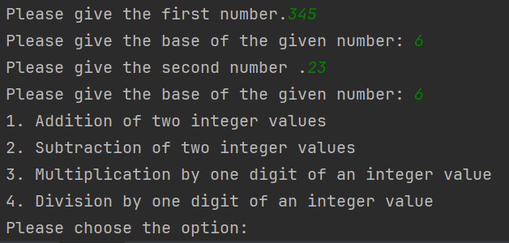

Problem statement:
Implement an application for:
 >⦁ arithmetic operations: addition, subtraction, multiplication and division by one digit, in a base p that belongs to 
{2,3,4, ..., 10} or 16 \
 > ⦁ conversions of natural numbers between two bases p, q belongs to {2,3,...,9,10,16} using the substitution method 
 or successive divisions and rapid conversions between two bases p, q belongs to {2, 4, 8, 16}.

Application features: 
 * Calculator part
    1. Addition of two integer values
    2. Subtraction of two integer values
    3. Multiplication by one digit of an integer value
    4. Division by one digit of an integer value
 
 * Conversion part
   1. Use rapid conversion.
   2. Use substitution method.
   3. Use successive divisions and multiplications.
   4. Use the base ten as an intermediate base.

*Running scenario :*

When the user first runs the app, it will print the following menu, where we can choose if we want to perform 
calculations or convertions:

If we choose to do conversions, we are asked for the number representation and the base in which it is represented, as
well as the base we want to convert the number to. Then, we are presented with the next menu choices, where we choose 
how we want to convert the number.

Each conversion method has its own validations:

If we choose to do calculations, the user will be asked to introduce both operands and their bases, then he is showed 
the following menu:

